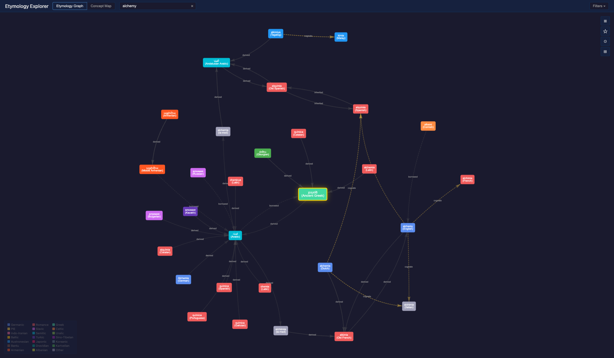
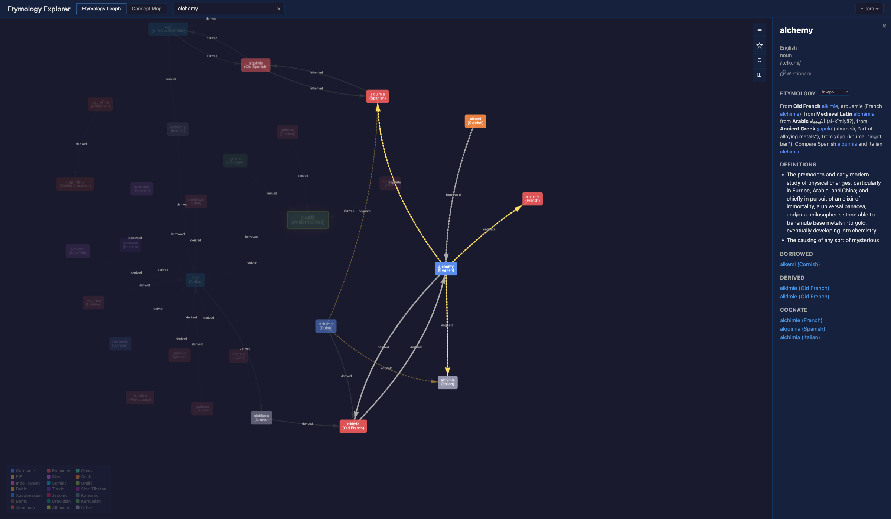
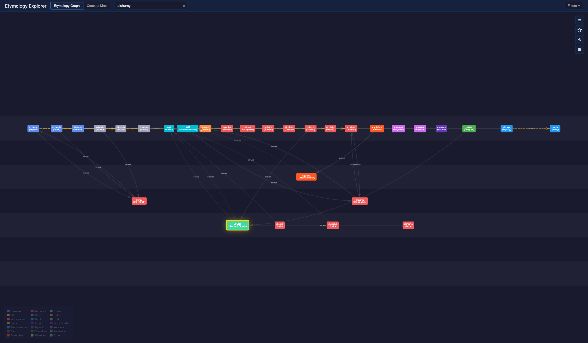
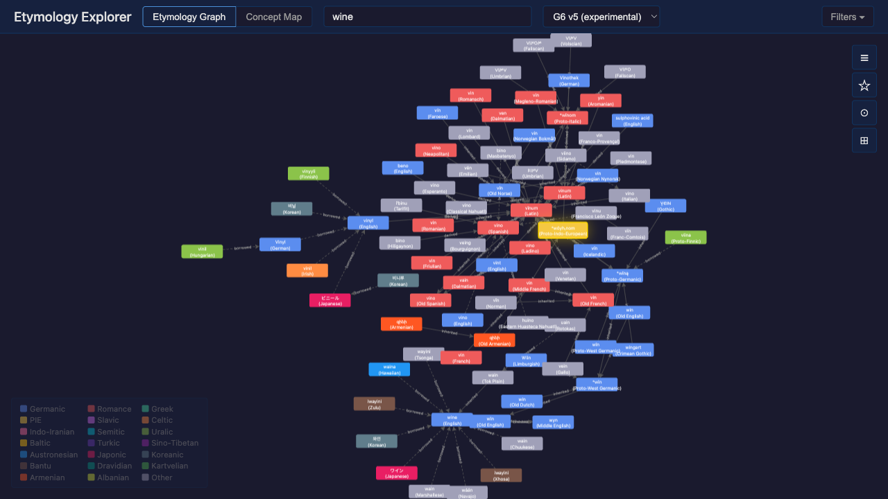
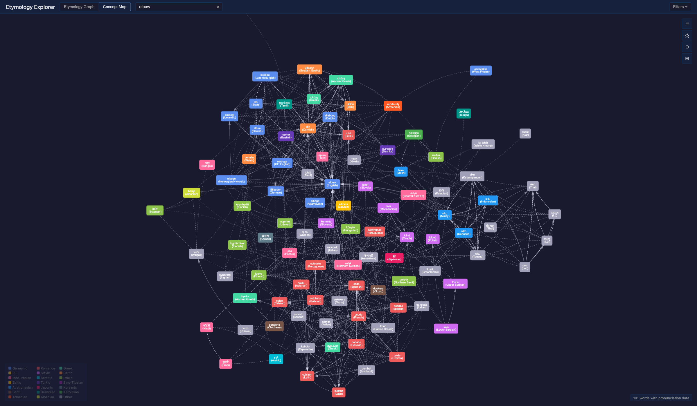

# Etymology Explorer

A local, interactive tool for visualizing the history of words. Every word in every language has a story — where it came from, how it traveled between cultures, and what other words it's related to. This app lets you see those stories as visual graphs you can click, zoom, and explore.

The data comes from [Kaikki.org](https://kaikki.org/), a structured extraction of all of [Wiktionary](https://en.wiktionary.org/) — over 10.4 million dictionary entries across thousands of languages, from Proto-Indo-European roots to modern slang. Everything runs locally on your machine via Docker. No accounts, no cloud services, no tracking.

<p align="center">
  
</p>

## What Can You Do With It?

### Etymology Graph

The core view. Type any word into the search bar, and you'll see a tree of that word's history — ancestors above, descendants below, related words branching out to the sides.

- **Search across all languages.** Autocomplete works across the entire 10.4 million entry database. Each suggestion shows the word and its language, so you can pick "busz (Hungarian)" versus "bus (English)."
- **See the full family tree.** The graph traces a word backwards through time to its oldest known ancestor, then shows all the other words that branched off at each step. Searching "wine" shows it going back through Old English, Latin, and possibly to Proto-Indo-European, with French "vin", Spanish "vino", and dozens of other languages branching off from the Latin ancestor.
- **Filter connection types.** Toggle four relationship types in the Filters panel:
  - *Inherited* — passed down within the same language family (e.g., Latin to French)
  - *Borrowed* — a loanword from another language (dashed lines)
  - *Derived* — a general derivation
  - *Cognate* — a related word from the same root in a different language (gold lines)
- **Click any node for details.** A side panel shows definitions, pronunciation (IPA), part of speech, a full etymology narrative, and a link to Wiktionary. Words mentioned in the etymology text are clickable — follow them to explore further.
- **Choose a layout.** Force-Directed (physics-based, words pull toward each other naturally) or Era Layers (horizontal bands by historical period, Proto-Indo-European at the bottom, modern languages at the top).
- **Switch renderers.** Two graph renderers are available in the Filters panel:
  - *vis.js (stable)* — the default Canvas 2D renderer, full-featured with era layers, clustering, and LOD
  - *G6 v5 (experimental)* — a WebGL-capable renderer by AntV for larger graphs, with force-directed layout and family-colored nodes. G6 loads on demand — no extra download until you select it.
- **Visual cues.** Nodes are colored by language family (20 families — Germanic is blue, Romance is red, Uralic is lime, etc.). Words with uncertain etymologies have dashed borders. The root ancestor has a gold glow.
- **Navigate easily.** Trackpad pinch to zoom, two-finger scroll to pan. Buttons to jump to the searched word, jump to the root, or fit the whole graph in view.

<table>
  <tr>
    <td align="center"><strong>Detail panel and hop-distance highlighting</strong></td>
    <td align="center"><strong>Era Layers layout</strong></td>
  </tr>
  <tr>
    <td></td>
    <td></td>
  </tr>
</table>

#### G6 Renderer (experimental)

Switch to the G6 v5 renderer via **Filters > Renderer** for a WebGL-accelerated force-directed view. Useful for exploring larger etymology trees where vis.js starts to slow down.

<p align="center">
  
</p>

### Concept Map

A different kind of exploration. Instead of "where did this word come from?", the concept map asks: "what do different languages call this thing, and which ones sound similar?"

- **Search for a concept** like "fire", "water", or "hand". The app finds all words across all languages that express that concept.
- **See phonetic similarity.** Words that sound alike cluster together, connected by dashed edges. Similarity uses Dolgopolsky consonant classes — a linguistic method that compares sound structure while ignoring vowels (since vowels shift more easily over time).
- **Adjust the similarity threshold.** A slider controls how similar words need to be before they're connected. Slide it down for more connections, up for only the closest matches.
- **Overlay etymology.** Toggle etymology edges to see which similar-sounding words are actually historically related (solid arrows) versus which just happen to sound alike (dashed lines).
- **Filter by part of speech.** Narrow results to nouns, verbs, or adjectives.
- **Jump to etymology.** Click any word and the detail panel includes a "View in Etymology Graph" button.

<p align="center">
  
</p>

## Things to Try

### Trace "wine" through history

This is the default word. You'll see it trace back through Old English "wīn" to Latin "vīnum", with branches showing French "vin", Spanish "vino", German "Wein", and many more. Notice the colors — blue for Germanic, red for Romance. Click the Latin node to see its details.

### Compare "fire" across languages

Switch to the Concept Map view (tabs at the top). Search for "fire". You'll see clusters: English "fire" groups with German "Feuer" and Dutch "vuur"; Greek "pyr" is nearby; but Finnish "tuli" and Turkish "ateş" are off in their own clusters. This shows which languages might share a common ancestor for this concept and which came up with their own word.

### Investigate an uncertain etymology

Search for "dog" in the Etymology Graph. The dashed border means its etymology is uncertain — the detail panel shows an uncertainty badge. English "dog" is one of the great mysteries of linguistics: nobody knows for sure where it came from. Compare it with "hound", which has a clear lineage back through Germanic.

## Getting Started

### Prerequisites

- [Docker Desktop](https://www.docker.com/products/docker-desktop/)
- Git

### Quick Start

```bash
git clone <repo-url> && cd etymo_graph
make setup              # Build, download data (~2 GB), load into MongoDB
make run                # Start all services
open http://localhost:8080
```

### Commands

| Command | Action |
|---------|--------|
| `make setup` | First time: build, download data, load into MongoDB |
| `make run` | Start all services |
| `make stop` | Stop all services |
| `make update` | Force re-download data + reload |
| `make logs` | View logs |
| `make clean` | Remove data and containers |

### Services

| Service | URL | Description |
|---------|-----|-------------|
| Frontend | http://localhost:8080 | Graph visualization UI |
| Backend API | http://localhost:8000 | FastAPI REST API |
| API Docs | http://localhost:8000/docs | Swagger UI |
| MongoDB | localhost:27017 | Database |

## Tech Stack

- **MongoDB** — stores the 10.4 million word entries from Wiktionary
- **FastAPI** (Python) — async API for search, etymology trees, and concept maps
- **Vanilla JavaScript + vis.js / G6 v5** — interactive graph rendering, no build step. vis.js is the default; G6 is an experimental alternative for larger graphs.
- **Docker Compose** — runs everything with one command

## Development

### Code Quality

```bash
make setup-dev  # Install linters and pre-commit hooks
make lint       # Run Ruff (Python) + ESLint (JavaScript)
make format     # Auto-format Python code
make test       # Run pytest
```

See [docs/CODING_STANDARDS.md](docs/CODING_STANDARDS.md) for the full coding standards.

### Claude Code Integration

This project includes [MCP](https://modelcontextprotocol.io/) server configurations for development with [Claude Code](https://code.claude.com/):

- **MongoDB MCP** — direct database queries and data inspection
- **Playwright MCP** — automated frontend testing and screenshots
- **GitHub MCP** — enhanced PR and issue management

MCP servers are automatically configured via `.mcp.json`. See `CLAUDE.md` for detailed documentation.

### Documentation

| File | Audience | Description |
|------|----------|-------------|
| [docs/FEATURES.md](docs/FEATURES.md) | Developers | Detailed feature docs, API reference, implementation status, known limitations |
| [docs/IMPLEMENTATION_PLAN.md](docs/IMPLEMENTATION_PLAN.md) | Developers | Original implementation plan and task breakdowns |
| [docs/CODING_STANDARDS.md](docs/CODING_STANDARDS.md) | Contributors | Python and JavaScript coding standards |
| [CLAUDE.md](CLAUDE.md) | AI agents | Project conventions, MCP setup, data notes |
| [specs/](specs/) | Developers | Feature specifications |

## Troubleshooting

**Docker not running**: Start Docker Desktop before running `make setup` or `make run`.

**Port conflict on 8080**: Another service is using the port. Stop it or change the port in `docker-compose.yml`.

**Blank page**: Check browser console for errors. Ensure vis.js CDN is accessible.

**G6 renderer not loading**: G6 is loaded from a CDN on first use. If your network blocks `unpkg.com`, the app will fall back to vis.js automatically.

**Concept map shows no results**: The phonetic data must be precomputed first. Run `make precompute-phonetic` (requires `lingpy` and `pymongo` installed locally).
